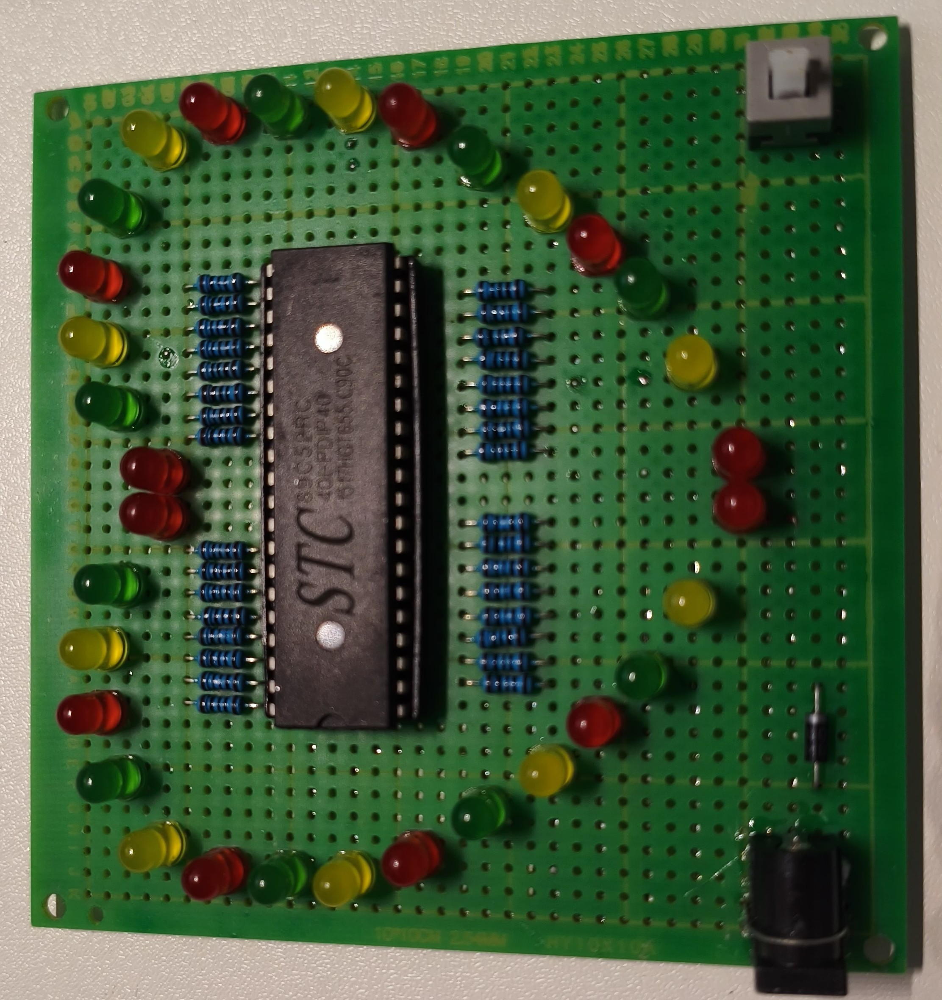
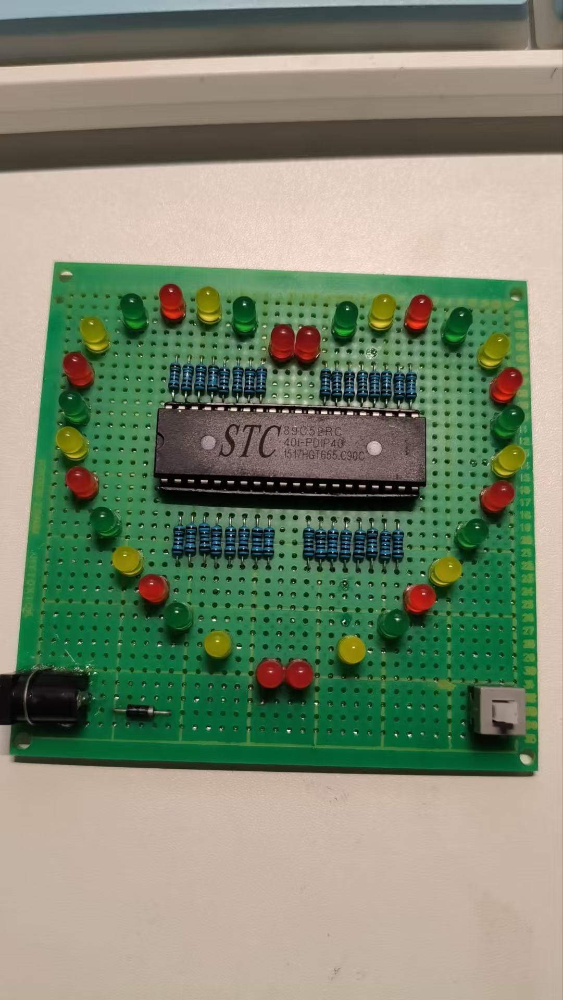
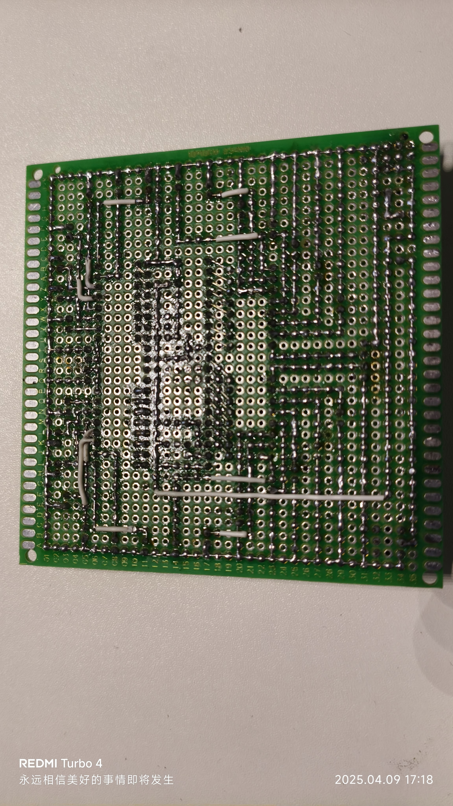

# 爱心流水灯项目

基于STC89C52RC单片机设计的多功能爱心形状LED流水灯系统。

## 项目简介

本项目使用STC89C52RC单片机作为控制核心，设计制作了一个爱心形状的LED显示装置。通过编程实现了多种绚丽的灯光效果，既可以用作装饰品，也可以作为电子设计教学项目。

## 功能特点

- 全体LED同时闪烁
- 顺时针流水灯效果
- 逆时针流水灯效果
- 两侧同时流水效果
- 呼吸灯效果（LED亮度渐变）
- 随机闪烁效果
- 交叉闪烁（左右交替）
- 心跳效果（快速闪烁三次）
- 波浪效果（中心向四周扩散）
- 跑马灯效果（四端口循环追逐）
- 渐变闪烁（不同频率）
- 螺旋效果（内外交替旋转）

## 项目结构

```
├── Keil_Project/            # 程序源代码
│   ├── main.c               # 主程序代码
│   └── Objects/             # 编译生成文件
├── PCB_Project/             # PCB设计文件
│   ├── love-flow-lamp.PrjPcb       # PCB项目文件
│   ├── love-flow-lamp.SchDoc       # 原理图文件
│   ├── love-flow-lamp.PcbLib       # PCB库文件
│   └── love-flow-lamp.PcbDoc       # PCB图纸文件
└── 实物图片/                 # 成品展示
```

## 开发环境

- IDE：Keil uVision 5
- PCB设计：Altium Designer
- 编程语言：C语言
- 目标芯片：STC89C52RC

## 项目演示

项目实物图片：





视频演示请查看：[B站视频链接](https://www.bilibili.com/video/BV14DdNYzEGN)

## 许可证

本项目采用 MIT 许可证